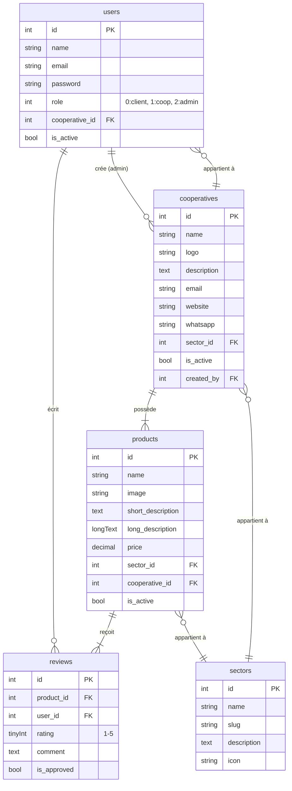

# Documentation de la Base de Données - Mantouji

## Introduction

Ce document détaille l'architecture de la base de données de la plateforme Mantouji après sa refonte. Il inclut le schéma final, la justification des choix techniques, le script SQL de création, et un tutoriel d'installation sur Arch Linux.

## Schéma Final de la Base de Données

Le schéma est organisé autour de 5 tables principales : `users`, `cooperatives`, `sectors`, `products`, et `reviews`.

### Diagramme Entité-Relation (ERD)



### Description des Tables

| Table | Description |
|---|---|
| `users` | Stocke les informations des utilisateurs (clients, membres de coopératives, admins). |
| `cooperatives` | Contient les détails de chaque coopérative (logo, contact, etc.). |
| `sectors` | Définit les filières d'activité (Miel, Huile d'olive, etc.). |
| `products` | Répertorie tous les produits, avec leurs descriptions, prix et liens. |
| `reviews` | Contient les avis et notes laissés par les clients sur les produits. |

### Choix des Types et Index

- **Types de données** : Les types ont été choisis pour être optimaux. Par exemple, `tinyInteger` pour `rating` (1-5), `decimal` pour `price` pour la précision financière, et `boolean` pour les statuts `is_active`.
- **Clés étrangères** : Des contraintes de clés étrangères sont utilisées pour garantir l'intégrité référentielle entre les tables (ex: `product.cooperative_id` -> `cooperatives.id`). L'option `onDelete('cascade')` est utilisée pour nettoyer automatiquement les données liées (ex: supprimer les produits d'une coopérative si celle-ci est supprimée).
- **Index** : Des index sont automatiquement créés sur les clés primaires et étrangères. Un index unique sur `reviews(product_id, user_id)` empêche un utilisateur de laisser plusieurs avis sur le même produit.

## Script SQL de Création

Voici le script SQL complet pour créer la structure de la base de données.

```sql
-- Création de la table `sectors`
CREATE TABLE `sectors` (
  `id` bigint(20) UNSIGNED NOT NULL AUTO_INCREMENT,
  `name` varchar(255) NOT NULL,
  `slug` varchar(255) NOT NULL,
  `description` text DEFAULT NULL,
  `icon` varchar(255) DEFAULT NULL,
  `created_at` timestamp NULL DEFAULT NULL,
  `updated_at` timestamp NULL DEFAULT NULL,
  PRIMARY KEY (`id`),
  UNIQUE KEY `sectors_slug_unique` (`slug`)
) ENGINE=InnoDB DEFAULT CHARSET=utf8mb4 COLLATE=utf8mb4_unicode_ci;

-- Création de la table `users`
CREATE TABLE `users` (
  `id` bigint(20) UNSIGNED NOT NULL AUTO_INCREMENT,
  `name` varchar(255) NOT NULL,
  `email` varchar(255) NOT NULL,
  `email_verified_at` timestamp NULL DEFAULT NULL,
  `password` varchar(255) NOT NULL,
  `role` tinyint(4) NOT NULL DEFAULT 0 COMMENT '0=client, 1=cooperative_user, 2=admin',
  `cooperative_id` bigint(20) UNSIGNED DEFAULT NULL,
  `is_active` tinyint(1) NOT NULL DEFAULT 1,
  `remember_token` varchar(100) DEFAULT NULL,
  `created_at` timestamp NULL DEFAULT NULL,
  `updated_at` timestamp NULL DEFAULT NULL,
  PRIMARY KEY (`id`),
  UNIQUE KEY `users_email_unique` (`email`)
) ENGINE=InnoDB DEFAULT CHARSET=utf8mb4 COLLATE=utf8mb4_unicode_ci;

-- Création de la table `cooperatives`
CREATE TABLE `cooperatives` (
  `id` bigint(20) UNSIGNED NOT NULL AUTO_INCREMENT,
  `name` varchar(255) NOT NULL,
  `logo` varchar(255) DEFAULT NULL,
  `description` text DEFAULT NULL,
  `email` varchar(255) DEFAULT NULL,
  `website` varchar(255) DEFAULT NULL,
  `whatsapp` varchar(255) NOT NULL,
  `sector_id` bigint(20) UNSIGNED DEFAULT NULL,
  `is_active` tinyint(1) NOT NULL DEFAULT 1,
  `created_by` bigint(20) UNSIGNED NOT NULL,
  `created_at` timestamp NULL DEFAULT NULL,
  `updated_at` timestamp NULL DEFAULT NULL,
  PRIMARY KEY (`id`),
  KEY `cooperatives_sector_id_foreign` (`sector_id`),
  KEY `cooperatives_created_by_foreign` (`created_by`),
  CONSTRAINT `cooperatives_created_by_foreign` FOREIGN KEY (`created_by`) REFERENCES `users` (`id`) ON DELETE CASCADE,
  CONSTRAINT `cooperatives_sector_id_foreign` FOREIGN KEY (`sector_id`) REFERENCES `sectors` (`id`) ON DELETE SET NULL
) ENGINE=InnoDB DEFAULT CHARSET=utf8mb4 COLLATE=utf8mb4_unicode_ci;

-- Ajout de la contrainte de clé étrangère à `users`
ALTER TABLE `users`
  ADD CONSTRAINT `users_cooperative_id_foreign` FOREIGN KEY (`cooperative_id`) REFERENCES `cooperatives` (`id`) ON DELETE CASCADE;

-- Création de la table `products`
CREATE TABLE `products` (
  `id` bigint(20) UNSIGNED NOT NULL AUTO_INCREMENT,
  `name` varchar(255) NOT NULL,
  `image` varchar(255) NOT NULL,
  `short_description` text DEFAULT NULL,
  `long_description` longtext DEFAULT NULL,
  `price` decimal(10,2) DEFAULT NULL,
  `sector_id` bigint(20) UNSIGNED DEFAULT NULL,
  `cooperative_id` bigint(20) UNSIGNED DEFAULT NULL,
  `is_active` tinyint(1) NOT NULL DEFAULT 1,
  `created_at` timestamp NULL DEFAULT NULL,
  `updated_at` timestamp NULL DEFAULT NULL,
  PRIMARY KEY (`id`),
  KEY `products_sector_id_foreign` (`sector_id`),
  KEY `products_cooperative_id_foreign` (`cooperative_id`),
  CONSTRAINT `products_cooperative_id_foreign` FOREIGN KEY (`cooperative_id`) REFERENCES `cooperatives` (`id`) ON DELETE CASCADE,
  CONSTRAINT `products_sector_id_foreign` FOREIGN KEY (`sector_id`) REFERENCES `sectors` (`id`) ON DELETE SET NULL
) ENGINE=InnoDB DEFAULT CHARSET=utf8mb4 COLLATE=utf8mb4_unicode_ci;

-- Création de la table `reviews`
CREATE TABLE `reviews` (
  `id` bigint(20) UNSIGNED NOT NULL AUTO_INCREMENT,
  `product_id` bigint(20) UNSIGNED NOT NULL,
  `user_id` bigint(20) UNSIGNED NOT NULL,
  `rating` tinyint(3) UNSIGNED NOT NULL,
  `comment` text DEFAULT NULL,
  `is_approved` tinyint(1) NOT NULL DEFAULT 0,
  `created_at` timestamp NULL DEFAULT NULL,
  `updated_at` timestamp NULL DEFAULT NULL,
  PRIMARY KEY (`id`),
  UNIQUE KEY `reviews_product_id_user_id_unique` (`product_id`,`user_id`),
  KEY `reviews_user_id_foreign` (`user_id`),
  CONSTRAINT `reviews_product_id_foreign` FOREIGN KEY (`product_id`) REFERENCES `products` (`id`) ON DELETE CASCADE,
  CONSTRAINT `reviews_user_id_foreign` FOREIGN KEY (`user_id`) REFERENCES `users` (`id`) ON DELETE CASCADE
) ENGINE=InnoDB DEFAULT CHARSET=utf8mb4_unicode_ci;
```

## Tutoriel d'Installation sur Arch Linux

Ce guide explique comment installer et configurer MariaDB (un fork de MySQL) sur Arch Linux pour la plateforme Mantouji.

### 1. Installation de MariaDB

Ouvrez un terminal et exécutez la commande suivante pour installer le paquet MariaDB :

```bash
sudo pacman -S mariadb
```

### 2. Initialisation de la base de données

Après l'installation, vous devez initialiser le répertoire de données de MariaDB. C'est une étape cruciale à ne faire qu'une seule fois.

```bash
sudo mariadb-install-db --user=mysql --basedir=/usr --datadir=/var/lib/mysql
```

### 3. Démarrage et activation du service MariaDB

Pour démarrer le service MariaDB et l'activer au démarrage du système, utilisez `systemd` :

```bash
# Démarrer le service maintenant
sudo systemctl start mariadb.service

# Activer le service au démarrage
sudo systemctl enable mariadb.service
```

### 4. Sécurisation de l'installation

Exécutez le script de sécurisation pour définir le mot de passe root, supprimer les utilisateurs anonymes, etc.

```bash
sudo mariadb-secure-installation
```

Suivez les instructions à l'écran. Il est fortement recommandé de définir un mot de passe root solide.

### 5. Création de la base de données et de l'utilisateur

Connectez-vous à MariaDB en tant qu'utilisateur root :

```bash
sudo mariadb -u root -p
```

Entrez le mot de passe root que vous venez de définir. Ensuite, exécutez les commandes SQL suivantes pour créer la base de données `mantouji` et un utilisateur dédié :

```sql
-- Créer la base de données
CREATE DATABASE mantouji CHARACTER SET utf8mb4 COLLATE utf8mb4_unicode_ci;

-- Créer l'utilisateur 'mantouji_user' avec son mot de passe
CREATE USER 'mantouji_user'@'localhost' IDENTIFIED BY 'mantouji_password';

-- Donner tous les privilèges à l'utilisateur sur la base de données
GRANT ALL PRIVILEGES ON mantouji.* TO 'mantouji_user'@'localhost';

-- Appliquer les changements
FLUSH PRIVILEGES;

-- Quitter
EXIT;
```

**Note** : Remplacez `mantouji_password` par un mot de passe sécurisé.

### 6. Import du schéma

Vous pouvez maintenant importer la structure de la base de données en utilisant le script SQL fourni. Placez-vous à la racine du projet Mantouji et exécutez :

```bash
mariadb -u mantouji_user -p mantouji < database_schema.sql
```

(Où `database_schema.sql` est le fichier contenant le script SQL ci-dessus).

Alternativement, si vous utilisez Laravel, vous pouvez simplement exécuter les migrations :

```bash
php artisan migrate
```

### 7. Configuration du backend (.env)

Enfin, assurez-vous que le fichier `.env` de votre projet Laravel est correctement configuré pour se connecter à la base de données que vous venez de créer :

```env
DB_CONNECTION=mysql
DB_HOST=127.0.0.1
DB_PORT=3306
DB_DATABASE=mantouji
DB_USERNAME=mantouji_user
DB_PASSWORD=mantouji_password
```

Votre backend est maintenant prêt à communiquer avec la base de données MariaDB sur votre système Arch Linux.
